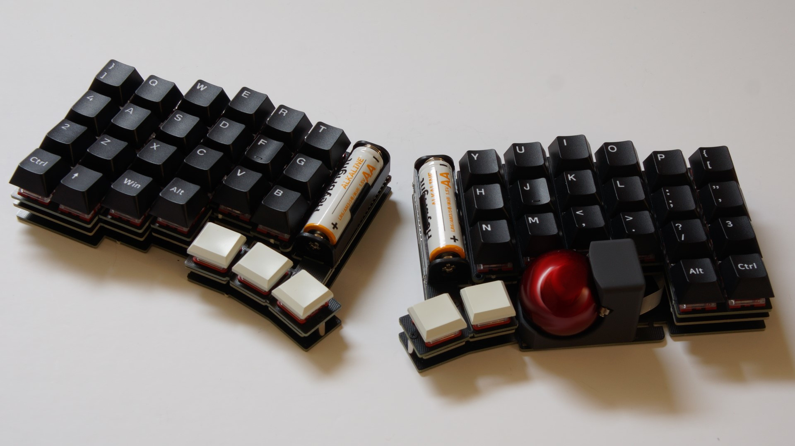
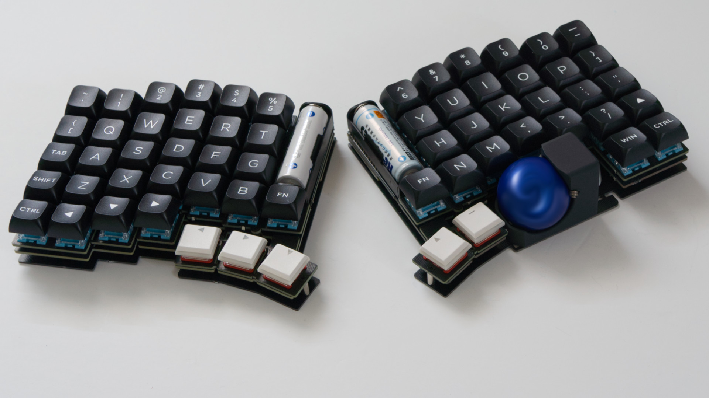

# torabo-tsuki

torabo-tsuki(トラボ付き)はトラックボール付きの無線分割キーボードキットです。

* [ビルドガイド](build-guide.md)

|  | |
|-|-|
|torabo-tsuki(S)を右利き用に組み立てたもの|torabo-tsuki(S)を左利き用に組み立てたもの|
|  | |
|torabo-tsuki(M)を右利き用に組み立てたもの|torabo-tsuki(M)を左利き用に組み立てたもの|
|  | |
|torabo-tsuki(L)を右利き用に組み立てたもの|torabo-tsuki(L)を左利き用に組み立てたもの|

## 入手先

- [BOOTH](https://nogikes.booth.pm/items/5774326)
- [遊舎工房](https://shop.yushakobo.jp/products/9414)

## 特徴

* 主要部品実装済み
  * ソケットやダイオードなどの部品は実装済みです。半田付けが必要な部品は4つだけです。
* 乾電池各1本で動作
  * Ni-MH電池またはアルカリ電池で動作します。
  * トラックボール操作中平均電流が2mA、待機時の平均電流が500~200μA（マスター側, 1.2V）と小さいので、乾電池でも長期間利用できます。
* トラックボールの設置位置が調整可能
  * トラックボールを取り付ける位置を調整して、自分にとって一番操作しやすい位置に設置できます。
* Vial対応
  * Vialを使用して簡単にキーマップが変更できます。
* 各種オプション設定を用意
  * トラックボールの感度や方向補正、バッテリーモード、JIS/USキーボード変換など、各種オプションを変更できるようにしています。

## 使用上の注意

* 異臭や煙が出たときは、ただちに使用を中止して電源を切り電池を抜いてください
* 電池から漏れた液が目に入った場合は、失明する恐れがあるのですぐにきれいな水でよく洗い、医師の診断を受けてください
* 電池の+-を正しくセットしてください
* 使い切った電池は速やかに取り出してください
* 長期間使用しない場合は電池を取り出してください
