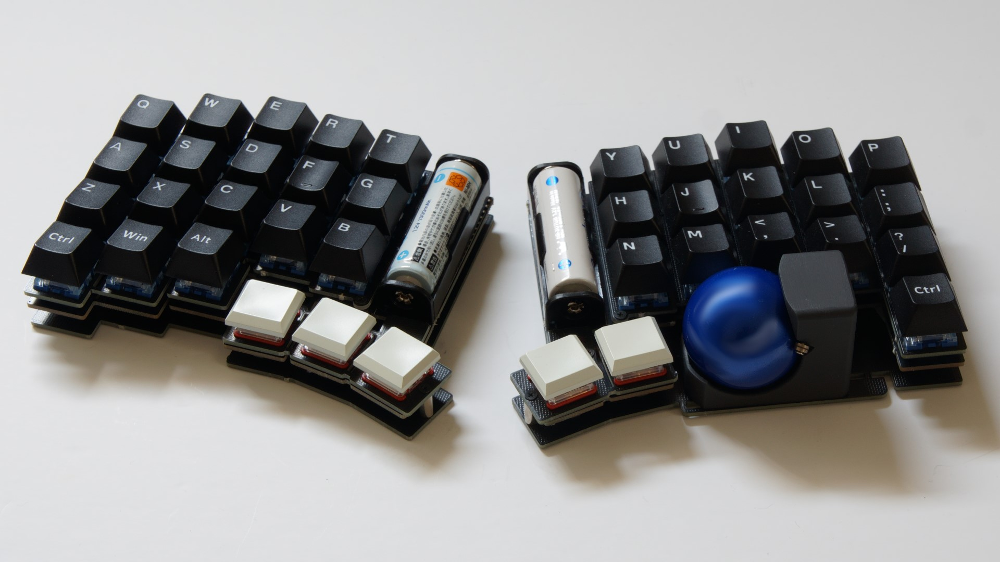
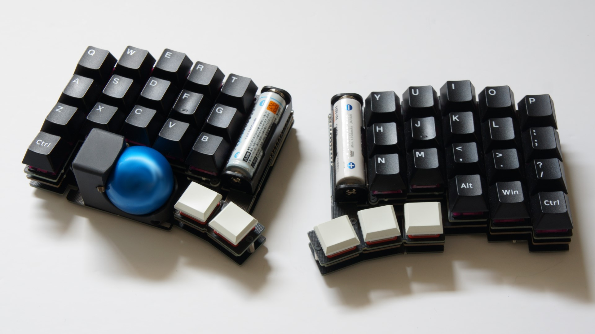

# torabo-tsuki

torabo-tsukiはトラックボール付きの無線分割キーボードキットです。

* [ビルドガイド](build-guide.md)

|  | |
|-|-|

## 特徴

* トラックボールの設置位置が調整可能
  * トラックボールを取り付ける位置を調整して、一番操作しやすい位置に設置できます。
* 低消費電力で乾電池各1本で動作
  * Ni-MH電池またはアルカリ電池で動作します。
  * トラックボール操作中平均電流が2mA、待機時の平均電流が500~200μA（マスター側）と小さいので、乾電池でも長期間利用できます。
* メイン部品実装済み
  * ソケットやダイオードなどの部品は実装済みです。はんだ付けが必要な部品は4つのみです。
* Vial対応
  * Vialを使用できるためファームウェアをビルドしなくても各種設定が変更できます。 
