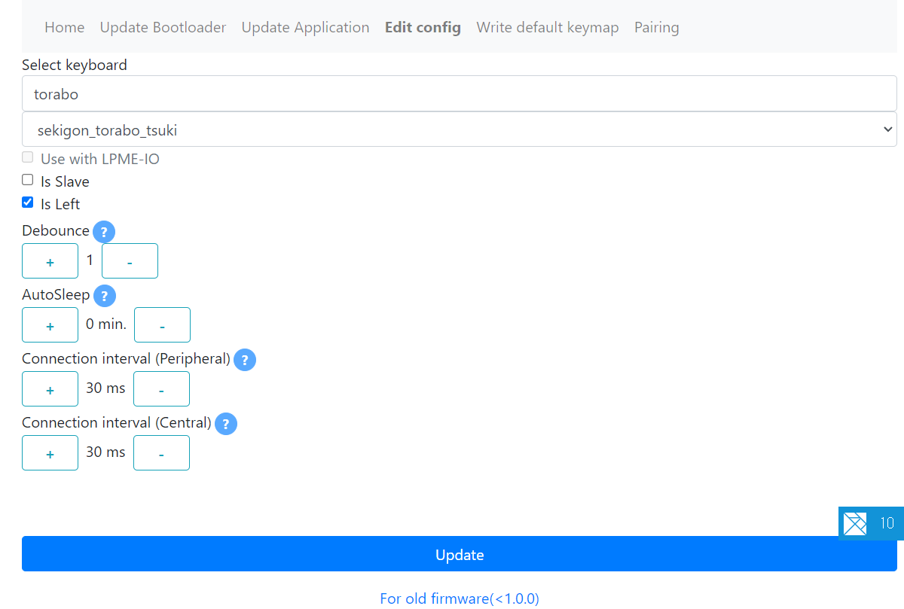
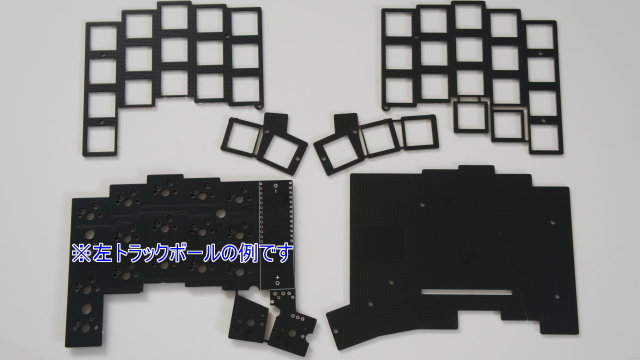

# ビルドガイド

## 同梱品

| 名称                   | 数  | 
| ---------------------- | --- |
| メイン基板             | 1   |
| トッププレート         | 2   |
| ボトムプレート         | 2   |
| 電池ボックス           | 2   |
| スライドスイッチ       | 2   |
| スペーサー(11mm)       | 8   |
| スペーサー(8.5mm)      | 4   |
| ねじ(低頭M2)           | 26  |
| クッションゴム         | 8   |
| **トラックボール部品** |     |
| トラックボールケース   | 1   |
| トラックボールセンサー | 1   |
| フレキシブルケーブル   | 1   |
| ベアリング             | 3   |
| ねじ(M1.4)             | 3   |
| **BMP同梱の場合**      |     |
| BLE Micro Pro          | 2   |

## 別途必要な部品

| 名称                     | 数   | 補足                                                                                                       |
| ------------------------ | ---- | ---------------------------------------------------------------------------------------------------------- |
| キースイッチ(MX)         | 34(S), 42(M), 56(L)   |                                                                                                            |
| キースイッチ(Choc)       | 5    |                                                                                                            |
| キーキャップ             | 適量 | MX, Chocそれぞれ                                                                                           |
| コンスルー               | 4    | 12ピン or 13ピン（高さ2.5mm）                                                                              |
| 34mmトラックボール交換球 | 1    |                                                                                                            |
| 単三電池                 | 2    | Ni-MH可。USBで充電できるリチウム電池内蔵のものを使う場合、必ずキーボードから取り外してから充電してください |
| **BMP同梱ではない場合**  |      |
| BLE Micro Pro            | 2    |                                                                                                            |

## 必要な工具

- はんだごて、はんだ
- ニッパー
- ペンチ
- ドライバー
- （やすり）
- PC
- USBケーブル

## 組立手順

### BLE Micro Proにファームウェアと設定を書き込む

* ChromeまたはEdgeで[BLE Micro Pro Web Configurator](https://sekigon-gonnoc.github.io/BLE-Micro-Pro-WebConfigurator/)を開いてください。
* `Update Bootloader`をクリックし、リストから最新版のブートローダーを選択してください。
* `Update`をクリックするとUSBデバイスへのアクセスを求めるポップアップが表示されます。
* USBケーブルでBLE Micro ProをPCに接続してください。
* ポップアップにあたらしく表示されたデバイスを選択して`接続`をクリックすると書き込みが始まります
  * デバイス名は画像と異なる場合があります。
* 書き込みが成功したら次のステップに進んでください。
  * 緑色ではなく青や赤の表示が出たら後述の書き込み失敗時の手順を確認してください。
 
|  |  |  |
| ------------------ | -------------------- | ------------------ |

* `Update Application`をクリックし、リストからtorabo-tsuki用の最新版ファームウェアを選択してください。
* `Update`をクリックするとUSBデバイスへのアクセスを求めるポップアップが表示されます。
* BLE Micro Proを選択して`接続`をクリックすると書き込みが始まります。
  * どのデバイスがBLE Micro Proか分からない場合はUSBケーブルを抜き差ししてデバイス一覧の変化を確認してください。
* 書き込みが成功したら次のステップに進んでください。

|  |  |  |
| ------------------ | -------------------- | ------------------ |

* `Edit Config`をクリックし、リストからtorabo-tsukiを選択してください。
  * `Is Slave`のチェックが外れていることを確認してください。
  * トラックボールを右手に付ける場合は`Is Left`のチェックも外してください。
* `Update`をクリックするとUSBデバイスへのアクセスを求めるポップアップが表示されます。
* torabo-tsukiを選択して`接続`をクリックすると書き込みが始まります。
  * torabo-tsukiが表示されない場合はファームウェアの書き込みができていないので最初のステップからリトライしてください。
* 書き込みが成功したら次のステップに進んでください。
  * 数十秒待っても書き込みが完了しなかったらブラウザをリロードしてUSBケーブルを抜き差してからリトライしてください。

|  |  |  |
| ------------------ | -------------------- | ------------------ |

* もう一個のBLE Micro Proでも同様にファームウェアを更新してください。
* `Edit Config`で書き込む設定は異なります。
  * `Is Slave`のチェックがついていることを確認してください。
  * トラックボールを右手に付ける場合は`Is Left`のチェックも付けてください。

|  |  |  |
| ------------------ | -------------------- | ------------------ |

#### ファームウェアの書き込みに失敗した場合

*  "Boot loader is activated. ~"と表示されている場合はそのままもう一度`Update`ボタンをクリックしてください。
*  "Failed to ~"と表示されている場合は他のソフトでシリアルポートを開いていないか確認してください。

|  |  |
| ------------------ | ------------------- |

### メイン基板のレール部分を折って切り離す

* レールとメイン基板の間についていた部分は電池ボックスをはんだ付けするときにスペーサーとして利用します。捨てないでください。
* レール -> スペーサー -> タブのように外側から順に折ってください。先にタブをメイン基板から切り離してからタブをスペーサーから切り離すのは大変です。

### メイン基板・トッププレートのトラックボール搭載部分と、トラックボールを搭載しないほうのボトム基板の余剰部分を切り離す

* 向きを間違えないように注意してください。下記画像は左側にトラックボールを搭載する例です。

### 電池ボックス、スライドスイッチをはんだ付けする

* 電池ボックスは先ほど切り離したスペーサーを間に挟んでください。
* スライドスイッチはトッププレートと干渉しないように足を短く切ってください。

### トッププレート・メイン基板にスイッチを差し込む

* トッププレートの上からスイッチをメイン基板に差し組んでください。
* ソケットが剥がれないように注意してください。裏から抑えながら差し込むことをおすすめします。
* 斜めに差し込むとスイッチのピンが折れ曲がってしまうことがあります。ソケット側から見てピンがしっかり刺さっていることを確認してください。

### メイン基板にBLE Micro Proをコンスルーで取り付ける

* 12ピンコンスルーは写真のようにずらして差し込んでください。
* はんだ付けは不要です。
* トラックボールを付けるほうをマスターにしてください。

### トッププレートにスペーサーをねじ止めする

* 低頭ねじでスペーサーをトッププレートにねじ止めしてください。
  * 親指部分には短いスペーサー、それ以外の部分に長いスペーサーを取り付けます。

### トラックボールケースにベアリングをネジで固定する

* ケースに空いている穴にねじを押し込みながら回すようにしてベアリングを固定してください。
    * ベアリングは多少ガタつきますが問題ありません。

### トラックボールセンサーにケーブルを差し込む

* コネクタのフラップ(黒い部分)を上に持ち上げ、トラックボールのケーブルをしっかり奥まで差し込み、フラップを下げます。

### トラックボールのケーブルをメイン基板のコネクタに差し込む

* トラックボールを取り付けたいほうのメイン基板でも同様にケーブルを差し込んでください。

### USBケーブルでPCとBLE Micro Proを接続し、センサーの動作確認をする

* マスター側をUSBケーブルで接続するとストレージとして認識されます。Status.txtの中身がOKになっていることを確認してください。
  * NGになっている場合は一度USBケーブルを抜き、トラックボールセンサーのケーブルが正しく差し込まれているか再確認してください。
* センサーのレンズ側を机から2mmくらい浮かせてセンサー基板を動かしたり、レンズの上空を指で動かしたりしてマウスカーソルが動くならば、センサーは正常に動作しています。 
* センサーの動作確認ができたらUSBケーブルは取り外してください。

### トラックボールセンサーをケースに取り付ける

* ケースの背面の穴とセンサー基板の穴が一致するあたりまで押し込んでください。
  * ケースに引っかかる場合はセンサー基板の突起をやすり掛けしてください。
  * 緩すぎてすぐ抜けてしまう場合は紙などを挟んで調節してください。

### ボトムプレートを取り付け、ボトムプレートにトラックボールケースを取り付ける

### トラックボールケースにボールを入れる

* ボールをケースに押し込んで入れてください。

### キーキャップを取り付ける

* キーキャップをキースイッチに取り付けたら組立は完了です。

**以上で組立は完了です、お疲れさまでした。SNSに投稿する際には #torabo_tsuki を付けていただけると見つけやすいので助かります。**

## 使い方

### 電源の説明

* 有線接続していないとき、親指のスライドスイッチを外側に切り替えると電源が入ります。電源がONするとLEDが点滅します。
* ペアリング先が見つからなかった場合はスリープモードに入ります。任意のキーを押すとスリープモードから復帰します。
  * 両手ともスリープモードから復帰させてください。
  * このときにPまたはQを押してしまうとブートローダーが起動してしまうため、それ以外のキーを押してください。

### LEDの説明

親指のところに赤色LEDがついています。

* 起動時：点滅回数(1~3)でバッテリー残量を示しています
* ペアリング中：ペアリング先を探している間、数秒に1回点灯します。ペアリングが完了すると1回点灯します。

### 左右間の無線接続

* 左右間のペアリングは両手の電源がONしてから数秒間のみ行われます。
* 最初の動作確認では、マスター側をPCに有線接続した後に、スレーブ側の電源を入れてください。
* スレーブ側のLEDが点灯してペアリングが完了するのを確認してください。
* ペアリング完了後、キーボードから入力・カーソル操作が可能であることを確認してください。

### Vialでキーマップを変更する

* マスター側を有線接続した状態でChromeまたはEdgeで[Vial](https://vial.rocks/)にアクセスし、Start Vialボタンをクリックしてポップアップからtorabo-tsukiを選択して接続してください。
    * 組み立てたバージョンにあわせてレイアウトタブからレイアウトを変更してください。
* キーマップの設定の詳細についてはQMKやBLE Micro Proのドキュメントを参照してください。
* デフォルトではQMKのAutomatic Mouse Layerが有効になっていて、レイヤー1がマウスレイヤーになっています。

| 機能                                                               | ラベル      | タブ                 |
| ------------------------------------------------------------------ | ----------- | -------------------- |
| 左クリック                                                         | Mouse 1     | App, Media and Mouse |
| 右クリック                                                         | Mouse 2     | App, Media and Mouse |
| 中クリック                                                         | Mouse 3     | App, Media and Mouse |
| 無線接続に切り替え                                                 | SEL BLE     | User                 |
| 有線接続に切り替え                                                 | SEL USB     | User                 |
| ペアリング済みデバイスを指定して無線接続                           | ADV IDn     | User                 |
| 新しいデバイスまたはペアリング済みのいずれかと接続                 | ADV W/O L   | User                 |
| 英語キーボードを日本語OSで動作させるためのオーバーライドを設定する | UJ OVR      | User                 |
| 日本語キーボードを英語OSで動作させるためのオーバーライドを設定する | JU OVR      | User                 |
| 上記オーバーライドを無効化                                         | D OVR       | User                 |
| ホールド中ボール操作でスクロールする                               | DRAG SCROLL | User                 |

### 各種設定を変更する

* [via-custom-ui-for-vial](https://sekigon-gonnoc.github.io/via-custom-ui-for-vial/)を使って設定を変更できます。
* masterを有線接続している状態でOpenボタンをクリックし、キーボードを選択するとメニューが表示されます。
* 各項目を変更後、Saveボタンを押して設定を保存してください。

| 項目           | 説明                                                                                 |
| -------------- | ------------------------------------------------------------------------------------ |
| CPI            | トラックボールの分解能                                                               |
| Rotate         | トラックボールの移動方向の傾き。単位はdeg                                            |
| Fine Layer     | 指定したレイヤーでカーソルの動きを細かくする                                         |
| Fine coef      | Fine Layerでの分解能の増加係数                                                       |
| Rough Layer    | 指定したレイヤーでカーソルの動きを荒くする                                           |
| Rough coef     | Rough Layerでの分解能の減少係数                                                      |
| AML Enable     | QMKのAutomatic Mouse Layer機能の有効化                                               |
| AML Layer      | AMLの移動先レイヤー                                                                  |
| AML Timeout    | AMLのタイムアウト時間。単位はms                                                      |
| AML Debounce    | AMLのデバウンス時間（マウスレイヤから復帰してから次にマウスレイヤに移動できるようにまでの時間）。単位はms                                                      |
| AML Threshold    | AMLの移動量閾値（マウスレイヤに移動するのに必要なカーソルの移動量）。単位はカウント                                                      |
| AML Delay    | AMLの禁止時間（マウス関係以外のキーを押してからマウスレイヤに移動できるようにまでの時間）。単位はms                                                      |
| Scroll layer   | 指定したレイヤーでトラックボールを動かすとスクロールする                             |
| Scroll Options | スクロール動作のオプション(Invert: 移動方向を反転、Snap: スクロール方向を縦横に制限) |
| Scroll Divide  | ボール操作量とスクロール移動量の比                                                   |
| Battery type   | 搭載している電池の種類。電池残量の表示とスリープ判定に使用                           |
| Battery mode   | パフォーマンスレベルを高くすると無線送信間隔が短くなる代わりに消費電流が増える。変更後はキーボードの再起動が必要       |

QMKの仕様として、レイヤ番号が大きいほうが優先されます。そのため、AMLとScroll/Fine/Roughを併用する際にはAMLのレイヤ番号が一番小さくなるように設定してください。

### (無線接続する場合)接続デバイスとペアリングする

* `ADV W/O L`に設定したキーを押してください。
* 接続したいデバイスの設定を開き、ペアリングしてください。
* すでに他のデバイスとペアリング済みの場合、それらのデバイスのBluetoothを無効化にしておく必要があります。

## トラブルと対策

* 初期不良による部品交換が必要な場合はBOOTHからメッセージをお送りください。
* 組立にあたってのトラブルで相談がある場合は[Self-Made Keyboards in Japan](https://discord.com/invite/self-made-keyboards-in-japan-376937950409392130)の[#mon-shin-forum](https://discord.com/channels/376937950409392130/635675786342432799)に投稿してください。
  * **投稿の前に#clinic-readmeを必ず一読し、問診票の記載にあたっては実施した作業を可能な限り詳細に記載してください。**
  * 投稿にはせきごん(_gonnoc)宛にメンションを付けていただくと投稿に気づきやすいです。
* 機能追加・開発に関する相談は同じくdiscordの #easy-question-forum に投稿してください。

### トラックボールの動きだしが遅い

* 一定時間ボールを動かさなかった場合にセンサーがスリープ状態になります。スリープ状態の解除に少し時間がかかるため動き出しが遅くなる場合があります。

### トラックボールの動きがおかしい/動かない

* トラックボールのケーブルがコネクタにしっかりささっているか確認してください。
* BMPを別のキーボードに差し込んで使用していたことがある場合は、ペアリングをやり直してみてください。
* センサーの仕様として、最大速度24inch/s、最大加速度10Gという制約があります。ボールの回転速度に換算すると6回転/sが最大速度で、これを超える速度で回転させた場合にはカーソルが逆方向に動くことがあります。

### 一部のキーが入力できない

* スイッチの足が折れ曲がっていないか、BLE Micro Proへのコンスルー取り付け位置が正しいか確認してください。

### 入力に遅延が発生する、接続がすぐ途切れる

* https://sekigon-gonnoc.github.io/via-custom-ui-for-vial/ を使って、battery modeをstandardからperformanceに変更してみてください。

### 親指のキーが抜ける

* 電源スイッチのピンがトッププレートを持ち上げてしまっていないか確認してください。持ち上げてしまっていた場合はニッパーで短く切ってください。
* スイッチがトッププレートにしっかり嵌まっているか（トッププレートが落ちてしまっていないか）確認してください。

## ファームウェアをビルドするには

Vialではできない細かい設定がしたい場合には、ファームウェアを編集・ビルドして書き込んでください。

* ソースコード: [https://github.com/sekigon-gonnoc/vial-qmk/tree/dev/ble-micro-pro/keyboards/sekigon/torabo_tsuki](https://github.com/sekigon-gonnoc/vial-qmk/tree/dev/ble-micro-pro/keyboards/sekigon/torabo_tsuki)
* [書き込み手順](https://sekigon-gonnoc.github.io/BLE-Micro-Pro/#/build_firmware?id=%e7%94%9f%e6%88%90%e3%81%97%e3%81%9f%e3%83%95%e3%82%a1%e3%83%bc%e3%83%a0%e3%82%a6%e3%82%a7%e3%82%a2%e3%82%92%e6%9b%b8%e3%81%8d%e8%be%bc%e3%82%80)
  * ブートローダーを起動するには、電源スイッチを切った状態でQまたはPを押しながらUSBケーブルを差し込んでください。
